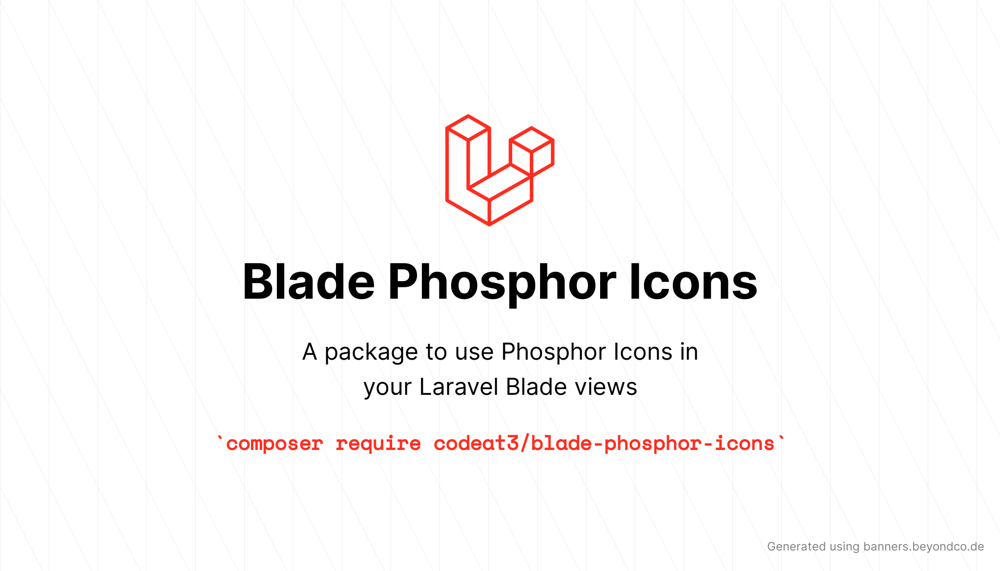

<p align="center">
    
</p>

# Blade Phosphor Icons

<a href="https://github.com/codeat3/blade-phosphor-icons/actions?query=workflow%3ATests">
    
</a>
<a href="https://packagist.org/packages/codeat3/blade-phosphor-icons">
    
</a>
<a href="https://packagist.org/packages/codeat3/blade-phosphor-icons">
    
</a>

A package to easily make use of [Phosphor Icons](https://github.com/phosphor-icons/phosphor-icons) in your Laravel Blade views.

For a full list of available icons see [the SVG directory](resources/svg) or preview them at [phosphoricons.com](https://phosphoricons.com/).

## Requirements

- PHP 7.4 or higher
- Laravel 8.0 or higher

## Installation

### For Phosphor Icons v1
```bash
composer require codeat3/blade-phosphor-icons:^1.0
```

### For Phosphor Icons v2
```bash
composer require codeat3/blade-phosphor-icons:^2.0
```

## Updating

Please refer to [`the upgrade guide`](UPGRADE.md) when updating the library.

## Blade Icons

Blade Phosphor Icons uses Blade Icons under the hood. Please refer to [the Blade Icons readme](https://github.com/blade-ui-kit/blade-icons) for additional functionality. We also recommend to [enable icon caching](https://github.com/blade-ui-kit/blade-icons#caching) with this library.

## Configuration

Blade Phosphor Icons also offers the ability to use features from Blade Icons like default classes, default attributes, etc. If you'd like to configure these, publish the `blade-phosphor-icons.php` config file:

```bash
php artisan vendor:publish --tag=blade-phosphor-icons-config
```

## Usage

Icons can be used as self-closing Blade components which will be compiled to SVG icons:

```blade
<x-phosphor-alarm/>
```

You can also pass classes to your icon components:

```blade
<x-phosphor-alarm class="w-6 h-6 text-gray-500"/>
```

And even use inline styles:

```blade
<x-phosphor-alarm style="color: #555"/>
```

For bold svg icon add `-bold` suffix

```blade
<x-phosphor-alarm-bold/>
```

For duotone svg icon add `-duotone` suffix

```blade
<x-phosphor-alarm-duotone/>
```

For fill svg icon add `-fill` suffix

```blade
<x-phosphor-alarm-fill/>
```

For light svg icon add `-light` suffix

```blade
<x-phosphor-alarm-light/>
```

For thin svg icon add `-thin` suffix

```blade
<x-phosphor-alarm-thin/>
```
### Raw SVG Icons

If you want to use the raw SVG icons as assets, you can publish them using:

```bash
php artisan vendor:publish --tag=blade-phosphor-icons --force
```

Then use them in your views like:

```blade

```

### Blade Icons

Blade Phosphor Icons uses Blade Icons under the hood. Please refer to [the Blade Icons readme](https://github.com/blade-ui-kit/blade-icons) for additional functionality.

## Changelog

Check out the [CHANGELOG](CHANGELOG.md) in this repository for all the recent changes.

## Maintainers

Blade Phosphor Icons is developed and maintained by [Swapnil Sarwe](https://swapnilsarwe.com).

## License

Blade Phosphor Icons is open-sourced software licensed under [the MIT license](LICENSE.md).
